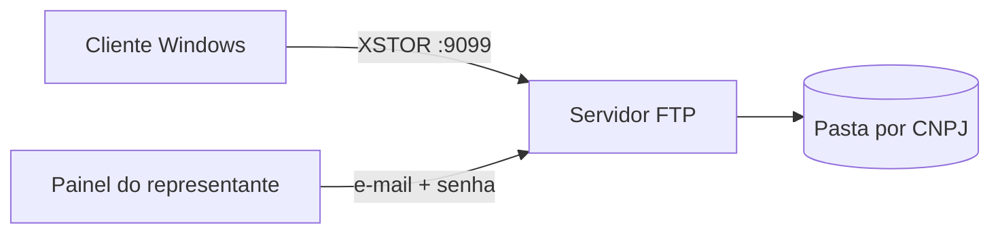

# Backup Firebird 3.0 + FTP

[](https://github.com/khastz95/backup-fdb-client/actions/workflows/ci.yml)
[](https://github.com/khastz95/backup-fdb-client/releases/latest)
[](LICENSE)
[](https://github.com/khastz95/backup-fdb-client/releases)

Copia de seguranca do banco **Firebird 3.0** no PC do cliente (`nbackup`: completo + incremental), arquivo local e envio a um FTP central. O representante acompanha os CNPJs pelo painel, baixa a cadeia e pode montar um `.fdb`.

**Download:** um comando no PowerShell — [docs/download.md](docs/download.md) · [Releases](https://github.com/khastz95/backup-fdb-client/releases/latest)

**Configurar:** [passo a passo](docs/configuracao.md) — **somente neste PC** ou **neste PC + FTP**. Modelos `*.example` so; nada de copiar `config.ini` de teste de outra maquina.

## Como encaixa



| Quem | Pasta | Programa |
|---|---|---|
| Empresa (cliente) | [`app/`](app/) | `BackupFdbCliente.exe` — [guia](docs/cliente.md) |
| Servidor | [`servidor/`](servidor/) | `iniciar-ftp.bat` na porta **9099** — [guia](docs/servidor.md) |
| Representante | [`painel-monitor/`](painel-monitor/) | `PainelMonitor.exe` — [guia](docs/painel.md) |

A porta **9000** pode continuar com um FTP antigo. Este servico usa **9099** e passivo **50200–50300**.

## Inicio rapido

```powershell
irm https://raw.githubusercontent.com/khastz95/backup-fdb-client/main/install.ps1 | iex
```

Isso baixa o codigo e os `.exe` do Release. Depois abra `docs\configuracao.md` no projeto (modo local ou FTP).

Para so clonar e compilar: Windows 10/11, [.NET Framework 4.8](https://dotnet.microsoft.com/download/dotnet-framework/net48), Firebird 3.0 onde for gerar ou montar `.fdb`.

```bat
git clone https://github.com/khastz95/backup-fdb-client.git
cd backup-fdb-client
build.bat
```

| Atalho | Faz |
|---|---|
| `painel.bat` | Abre a interface do **cliente** |
| `executar.bat` | Roda um backup agora |
| `abrir-painel.bat` | Abre o painel do **representante** |
| `servidor\iniciar-ftp.bat` | Sobe o FTP (deixe a janela aberta) |

Guias: [configuracao](docs/configuracao.md) · [download](docs/download.md) · [cliente](docs/cliente.md) · [servidor](docs/servidor.md) · [painel](docs/painel.md) · [restaurar](docs/restaurar.md)

## Repositorio

```
app/                 codigo do cliente WinForms
servidor/            FTP PowerShell + usuarios SQLite
painel-monitor/      painel do representante
docs/                guias
.github/             CI, issues e pull requests
config.ini.example   modelo do cliente (sem senha)
```

## Contribuir

Veja [CONTRIBUTING.md](CONTRIBUTING.md) e o [codigo de conduta](CODE_OF_CONDUCT.md). Historico de versoes: [CHANGELOG.md](CHANGELOG.md).

## Licenca

[MIT](LICENSE) © 2026 Alfa Automacao
